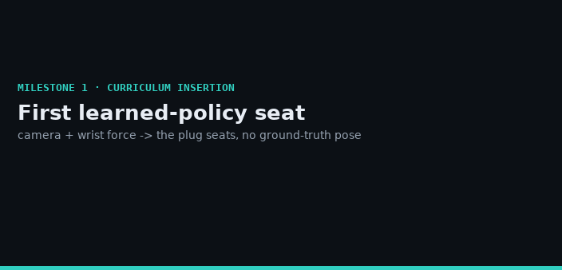
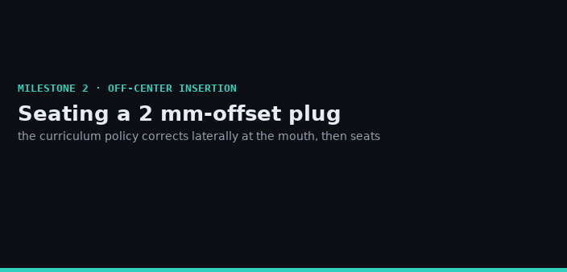
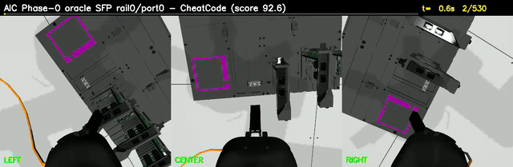
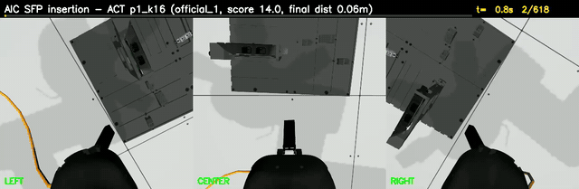
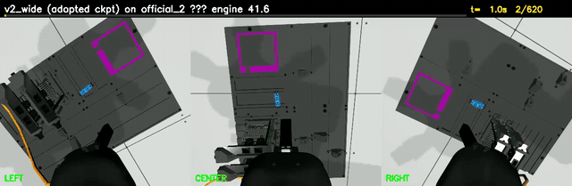

# Camera-Only Imitation Learning for Robotic Cable Insertion

**A learned visuomotor policy that inserts SFP/SC fiber-optic plugs into NIC ports with a UR5e — localizing from RGB cameras only (no ground-truth poses, no depth) and seating with wrist force.**
Built on the [Intrinsic AI for Industry Challenge](https://www.intrinsic.ai/events/ai-for-industry-challenge) toolkit (Gazebo simulation, real contact physics, force-aware scoring). This fork adds the full research pipeline: oracle distillation, ACT-style policy learning, a hardened evaluation harness, and a statistics-first experiment log.

## Milestones

The **RUN&nbsp;#4 curriculum** reopened the insertion problem: privileged-stage the plug above the port, learn the *seating* skill from vision + force, then grow the lateral offset stage by stage. That produced the project's first learned-policy seats — and a systematic study of exactly how far off-center they generalize, and why. The full interactive write-up (dose-response, code-verified mechanism, and the partial-observability analysis) is [`dashboard/showcase.html`](dashboard/showcase.html) *(open in a browser)*; the running lab notebook is [`SESSION_REPORT.md`](SESSION_REPORT.md).

### Milestone 1 — First learned-policy seat



The project's first insertion by a **learned** policy — every prior seat came from the scripted oracle. Staged above an aligned port, the policy (3 RGB cameras + wrist force, **no ground-truth pose at run time**) descends and seats the SFP plug. Engine **93/100** (tier-3); **3/3** on the matched-seed suite.

### Milestone 2 — Off-center insertion (2&nbsp;mm)



Growing the staged lateral offset, the policy learns to correct at the mouth and seat a **2&nbsp;mm-offset** plug (engine **92.7**). This is the edge of the learned capture radius: ~50% reliable at 2&nbsp;mm, and beyond it the plug drifts past *before it can feel the port* — a **partial-observability** limit (the offset isn't visible until contact) dissected in the write-up, along with a contact-gated fix that was built, tested, and honestly shown to arrive too late.

<details>
<summary><b>Earlier runs</b> — camera-only approach, pre-curriculum</summary>

| Scripted oracle — a full SFP insertion (the task) | Learned policy — camera-only rollout |
|:---:|:---:|
|  |  |
| `CheatCode` oracle (reads ground-truth port poses) seats the plug — engine ≈93/100. The teacher and per-trial upper bound. | ACT policy (3 RGB cams + TCP state, ~0.75 M params) drives a clean approach on an official config. 2.5× speed, three-camera view. |

| Adopted checkpoint `v2_wide` on official_2 — engine 41.6 |
|:---:|
|  |
| Characteristic pre-curriculum behavior on a harder pose: a clean camera-only approach that stalls ~5–8&nbsp;cm from the port (the **last-inch attractor**). The curriculum milestones above are how the seat was finally reached. |

</details>

*Milestone GIFs: a title card, then the 3-camera rollout (left / center / right) with the measured result. Earlier-run GIFs are 2.5× timelapses.*

## Results

| Evaluation | Score | Notes |
|---|---:|---|
| **Best official-config eval (3 trials, /300)** | **119.4** | adopted checkpoint `v2_wide`, **with successful insertions** on the official poses |
| Oracle (scripted, ground-truth poses) | ≈93 / 100 per trial | distillation teacher; 97.5 % keep-rate over a 40-config collection campaign |
| 180-s matched-seed suite, 15 configs (mean) | v2_wide 7.75 · p2_k8 5.29 · p1_k16 3.03 | harder stratified poses; officials-only sums: 97.7 / 64.9 / 68.8 (/300) |
| Unit tests | 295 green | pure-logic seams for config gen, dataset prep, chunk ensembling, eval harness |

**The central research finding:** on poses harder than the official ones, every checkpoint approaches cleanly and then stalls 0.05–0.08 m from the port for the full trial — a **last-inch fixed-point attractor** caused by mode-averaging of a deterministic ACT head toward the demos' zero-velocity endings ([Zhao et al., 2023, arXiv:2304.13705](https://arxiv.org/abs/2304.13705)). The ranked fixes (last-inch DAgger, CVAE action head, residual RL — [ResiP](https://arxiv.org/abs/2407.16677) / [RLDG](https://arxiv.org/abs/2412.09858)) are laid out in [SESSION_REPORT.md](./SESSION_REPORT.md).

**The evaluation-rigor finding:** identical config + seed trials vary by **σ ≈ 3–18 points** run-to-run (Gazebo/ROS timing nondeterminism), enough to flip trial outcomes. A promising single-run A/B result (temporal ensembling, "+3.9, wins on 5/5 configs") was **overturned** by a 15-config paired-bootstrap confirmation and a 3-repetitions-per-arm experiment (30 trials): no real effect, added variance. All adoption decisions here are therefore CI-backed at n≥3 — the negative result and the noise-floor measurement are documented as first-class deliverables.

## Method

```
gen_config.py                 # stratified randomized scene configs (rail × plug × port × yaw band)
  └─ collect_campaign.sh      # CheatCode oracle rollouts → rosbags (resumable, score-gated keeps)
       └─ prepare_dataset.py  # bag → synced .npy episodes (3 cams + TCP state, task-window trimmed)
            └─ train_v3       # ACT-style CNN + action chunking (K×6 TCP-velocity chunks, ~17 min/run)
                 └─ DeployACT # receding-horizon MODE_POSITION execution @ ~18 Hz
eval_suite.py + eval_batch.sh # matched-seed suites, IQM + paired-bootstrap CIs, resumable batches
```

- **Observation → action:** 3 RGB cameras + 7-D TCP state → chunk of K×6 TCP velocities; execute the first 4 actions, re-predict (receding horizon).
- **Why image-based ACT (not point-cloud DP3):** the sim bridges RGB only — no depth topics.
- **Deployment insight that unlocked scoring:** the stock velocity mode integrates its reference open-loop and freezes the arm; re-anchoring every chunk through position-mode targets took the score from 36 → 119.4.
- **Dataset:** 93 oracle episodes across stratified + failure-driven collection phases.

## Engineering highlights

- **Resumable, self-healing eval harness** — flock-guarded batches, orphan sweeps, skip-if-done resume, DONE markers; survived a 48 h autonomous run with a 5-minute liveness watchdog.
- **Statistics-first protocol** — matched-seed suites, IQM + paired-bootstrap CIs, measured sim noise floor, n≥3 repetition rule codified after it overturned a false positive.
- **295 unit tests** (stdlib `unittest`, no ROS/GPU needed) over every pure-logic seam.
- **Full lab notebook** — [`SESSION_REPORT.md`](./SESSION_REPORT.md) records every experiment with tables, verdicts, and paper citations; [`progress.md`](./progress.md) is the 2-hourly run log.

## Where to look

| File | What it is |
|---|---|
| [`SESSION_REPORT.md`](./SESSION_REPORT.md) | The lab notebook: every experiment, result table, and adoption decision |
| [`Plan.md`](./Plan.md) / [`ResearchPlan.md`](./ResearchPlan.md) | Architecture rationale and research plan |
| [`aic_example_policies/.../DeployACT.py`](./aic_example_policies/aic_example_policies/ros/DeployACT.py) | The deployed policy node (receding horizon + opt-in chunk ensembling) |
| [`eval_suite.py`](./eval_suite.py), [`eval_batch.sh`](./eval_batch.sh) | Matched-seed evaluation suites + resumable batch runner |
| [`train_smoke.py`](./train_smoke.py), [`prepare_dataset.py`](./prepare_dataset.py) | Training and dataset pipeline |

---

# AI for Industry Challenge Toolkit (upstream)

[](https://github.com/intrinsic-dev/aic/actions/workflows/build.yml)
[](https://github.com/intrinsic-dev/aic/actions/workflows/style.yml)

The **AI for Industry Challenge** is an open competition for developers and roboticists aimed at solving some of the hardest, high-impact problems in robotics and manufacturing. This repository contains the official toolkit; for registration details, official rules, and FAQs, visit the [event page](https://www.intrinsic.ai/events/ai-for-industry-challenge).

## Toolkit Guide

Welcome to the AIC toolkit documentation. This guide walks you through the complete workflow for participating in the challenge — from understanding the requirements to submitting your solution.

Follow the sections below to navigate through each phase of the process.

1. **📖 Understand the Challenge**
   - Read the [Challenge Overview](./docs/overview.md) to understand the goals.
   - Review the [Qualification Phase](./docs/phases.md#qualification-phase-train-your-model) to understand what you'll be building.
   - Review the [Scoring Guide](./docs/scoring.md) to understand how you'll be scored.

2. **🔧 Set Up Your Environment**
   - Follow the [Getting Started](./docs/getting_started.md) guide to set up and validate your development environment.
   - Run the evaluation container and set up your local workspace with Pixi.

3. **💻 Develop Your Policy**
   - Explore the [Scene Description](./docs/scene_description.md) to learn how to customize and explore the environment.
   - Review [AIC Interfaces](./docs/aic_interfaces.md) to understand available interfaces to communicate with sensors and actuators.
   - Consult [AIC Controller](./docs/aic_controller.md) to learn about controlling the robot.
   - Consult the [Challenge Rules](./docs/challenge_rules.md) to ensure compliance.
   - Start with the [Policy Integration Guide](./docs/policy.md) to implement your solution.
   - See [Participant Utilities](./docs/participant_utilities.md) for a list of helpful tools.

4. **🧪 Test Your Solution**
   - Use the provided simulation environment to test your policy.
   - Run `aic_engine` with the `sample_config` in [`aic_engine/config/`](./aic_engine/config/) to test different scenarios. For more information on running the `aic_engine` with different configs, see the [aic_engine README file](./aic_engine/README.md).
   - Create your own test scenarios by following the configuration example in [`aic_engine/config/`](./aic_engine/config/) to run with `aic_engine`.
   - Refer to [Troubleshooting](./docs/troubleshooting.md) if you encounter issues.

5. **📦 Submit Your Entry**
   - Package your solution following the [Submission Guidelines](./docs/submission.md).
   - Test your container locally before submitting following [these instructions](./docs/submission.md#verify-locally).
   - Submit through the official portal following [these instructions](./docs/submission.md#2-upload-your-image-to-our-registry).

---

## Toolkit Architecture


The AI for Industry Challenge toolkit is divided into **two main components**:

### 1. Evaluation Component (Provided - Run by Organizers)

This component provides the complete evaluation infrastructure:
- **`aic_engine`** - Orchestrates trials and computes scores.
- **`aic_bringup`** - Launches simulation environment (Gazebo, robot, sensors).
- **`aic_controller`** - Low-level robot control with force management.
- **`aic_adapter`** - Sensor fusion and data synchronization.

**What you receive:** Standard ROS sensor topics providing camera images, joint states, force/torque measurements, and TF frames.

### 2. Participant Model Component (Your Implementation - What You Submit)

This is what you develop and submit:
- **A ROS 2 node** that follows the behavioral requirements defined in [Challenge Rules](./docs/challenge_rules.md).
- **Your custom logic** - Code to process sensor data and command the robot to insert cables.

**What you provide:** A container with a ROS 2 Lifecycle node named `aic_model` that responds to the `/insert_cable` action and outputs robot motion commands via standard ROS topics/services.

**Convenient Entry Point:** We provide an `aic_model` framework that handles all the ROS 2 boilerplate and lifecycle management. You simply implement a Python policy class that gets dynamically loaded at runtime. See the [Policy Integration Guide](./docs/policy.md) for details.

### Development and Submission Workflow

> [!IMPORTANT]
> **ROS 2 Distribution:** The official evaluation of all submissions will be conducted using **ROS 2 Kilted Kaiju**. If you choose to develop or test your policy using a different ROS 2 distribution (e.g., Humble or Jazzy), it is entirely your responsibility to ensure compatibility and support. Please note that **inter-distro communication is not guaranteed and not officially supported**.

**Development Options:**
- Develop inside a container (recommended - matches evaluation environment).
- OR develop in native Ubuntu 24.04 environment (requires all dependencies).

**Submission Requirements:**
- Package your solution using the provided `aic_model` Dockerfile.
- Submit your container - it must respond to standard ROS inputs and command the robot to insert cables.
- Your container interfaces with the evaluation component via ROS topics.

---
## Repository Structure

```
aic/
├── aic_adapter/          # Adapter for interfacing between model and controller
├── aic_assets/           # 3D models and simulation assets
├── aic_bringup/          # Launch files for starting the challenge environment
├── aic_controller/       # Robot controller implementation
├── aic_description/      # Robot and environment URDF/SDF descriptions
├── aic_engine/           # Trial orchestration and validation engine
├── aic_example_policies/ # Example policy implementations
├── aic_gazebo/           # Gazebo-specific plugins and configurations
├── aic_interfaces/       # ROS 2 message, service, and action definitions
├── aic_model/            # Template for participant policy implementation
├── aic_scoring/          # Scoring system implementation
├── aic_utils/            # Utility packages and tools
├── docker/               # Docker container definitions
└── docs/                 # Comprehensive documentation
```

---

## Key Packages for Participants

### `aic_model` - Convenient Policy Framework (Recommended)
This package provides a ready-to-use ROS 2 Lifecycle node that dynamically loads and executes your Python policy implementation. It handles all ROS 2 boilerplate, lifecycle management, and challenge rule compliance, allowing you to focus on implementing your policy logic.
- **Location**: `aic_model/`.
- **Documentation**: [Policy Integration Guide](./docs/policy.md).
- **Tutorial**: [Creating a New Policy Node](./docs/policy.md#tutorial-creating-a-new-policy-node).

> **Note:** While we recommend using this framework, you may implement your own ROS 2 node from scratch as long as it adheres to the [Challenge Rules](./docs/challenge_rules.md).

### `aic_interfaces` - Communication Protocols
Defines all ROS 2 messages, services, and actions used in the challenge.
- **Location**: `aic_interfaces/`.
- **Documentation**: [AIC Interfaces](./docs/aic_interfaces.md).

### `aic_example_policies` - Reference Implementations
Example policies demonstrating different approaches and techniques.
- **Location**: `aic_example_policies/`.
- **README**: [aic_example_policies/README.md](./aic_example_policies/README.md).

### `aic_bringup` - Launch the Environment
Launch files to start the simulation, robot, and scoring systems.
- **Location**: `aic_bringup/`.
- **README**: [aic_bringup/README.md](./aic_bringup/README.md).

### `aic_engine` - Trial Orchestrator
Manages trial execution, validates participant models, and collects scoring data.
- **Location**: `aic_engine/`.
- **README**: [aic_engine/README.md](./aic_engine/README.md).

---

## Additional Documentation

### Challenge Information

* **[Challenge Overview](./docs/overview.md):** High-level summary of the competition goals and structure.
* **[Competition Phases](./docs/phases.md):** Details on Qualification, Phase 1, and Phase 2.
* **[Qualification Phase](./docs/qualification_phase.md):** Detailed technical overview of the qualification phase trials and scoring.
* **[Challenge Rules](./docs/challenge_rules.md):** Required behavior for participant models.
* **[Scoring](./docs/scoring.md):** Metrics and methods used to evaluate performance.
* **[Scoring Test Examples](./docs/scoring_tests.md):** Reproducible examples exercising each scoring tier with exact commands.

### Technical Documentation

* **[Getting Started](./docs/getting_started.md):** How to set up your local development environment.
* **[Policy Integration](./docs/policy.md):** Guide to implementing your policy in the `aic_model` framework.
* **[AIC Interfaces](./docs/aic_interfaces.md):** ROS 2 topics, services, and actions available to your policy.
* **[AIC Controller](./docs/aic_controller.md):** Understanding the robot controller and motion commands.
* **[Scene Description](./docs/scene_description.md):** Technical details of the simulation environment.
* **[Task Board Description](./docs/task_board_description.md):** Physical layout and specifications of the task board.
* **[Troubleshooting](./docs/troubleshooting.md):** Common issues and debugging strategies.

### Reference Materials

* **[Glossary](./docs/glossary.md):** Terminology and definitions used throughout the AI for Industry Challenge

### Submission

* **[Submission Guidelines](./docs/submission.md):** How to package and submit your final model.

---


## Support and Resources

- **Discussions**: Engage in conversations and ask questions about the challenge on [Open Robotics Discourse](https://discourse.openrobotics.org/c/competitions/ai-for-industry-challenge/). The community is encouraged to participate in discussions and assist each other.
- **Issues**: Report any bugs or technical issues via [GitHub Issues](https://github.com/intrinsic-dev/aic/issues). Please refrain from using the Issue tracker for general questions about the challenge.
  - **Note:**: Review the list of [known issues](https://github.com/intrinsic-dev/aic/issues?q=is%3Aissue%20state%3Aopen%20label%3A%22known%20issue%22) and [bugs](https://github.com/intrinsic-dev/aic/issues?q=is%3Aissue%20state%3Aopen%20label%3Abug) before opening a new ticket.
- **Event Page**: Visit the [AI for Industry Challenge](https://www.intrinsic.ai/events/ai-for-industry-challenge) for official updates.

---

## License

This project is licensed under the Apache License 2.0 - see the individual package files for details.
The [aic_isaac](./aic_utils/aic_isaac/) folder contains files licensed under BSD-3 - see [aic_isaac/LICENSE](./aic_utils/aic_isaac/LICENSE).
